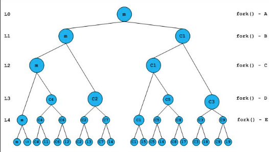

# fork
- `<unistd.h>`
- `pid_t fork(void)`
- spliting a Proccess into a Child and a Parent Process 
- `0` --> Child Process 
- `>0` --> Parentprocess 
- `< 0` --> Error 


## Examples
### A double forked Process
- mit einem weiteren weiteren fork() -> Erzeuge ich von allen laufenden Prozessen ein neuen Prozess -> So mit hat der erste Prozess 2 Eltern Prozesse! 
das bedeutet ich habe mit einem 2hoch fork() Prozesse laufen! 

```c
#include <stdio.h>
#include <sys/wait.h>
#include <unistd.h>
#include <time.h>
#include <errno.h>

int main (void)
{
    int id_1 = fork();
    int id_2 = fork();

    if (id_1 == 0)
    {
        if (id_2 == 0)
            printf("We are in the proces Y\n");
        else 
            printf("We are in the process x\n");  
    }
    else {
        if (id_2 == 0)
            printf("We are in the process z\n");
        else
            printf("We are int the parent Process\n"); 
    }
    while (wait(NULL) != -1 || errno != ECHILD)
    {
        printf("wait to child\n");
    }
    
    return (0);
}
```


### A multiple forked Process 
```C
#include <stdio.h>
int main()
{
   fork(); /* A */
   ( fork()  /* B */ &&
     fork()  /* C */ ) || /* B and C are grouped according to precedence */
   fork(); /* D */
   fork(); /* E */

   printf("forked\n");
   return 0;
}
```

